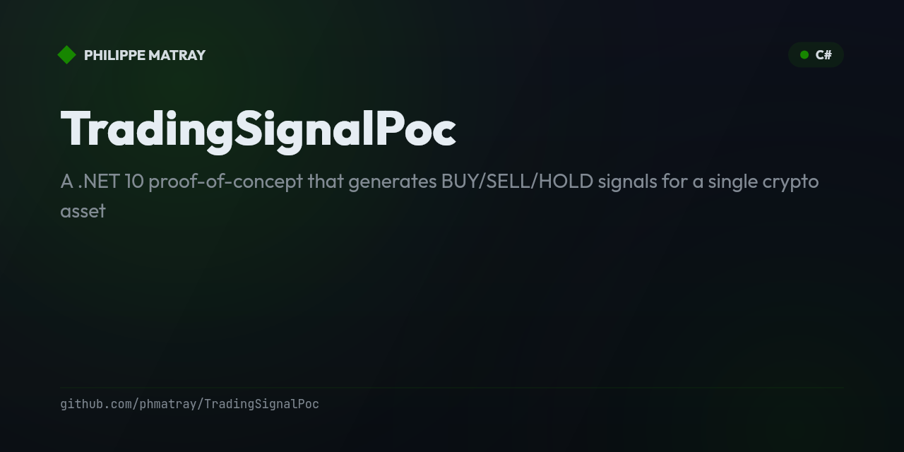

# Trading Lab

<!-- portfolio-badges:start -->
<!-- Identity -->

<!-- Activity -->

<!-- portfolio-badges:end -->

<!-- portfolio-toc:start -->

## Features

- **A workbench of trading approaches** — platform, backtester, signal PoC, charting, bots and experiments
- **.NET and Python** side by side
- **Indicators live separately** in TaLibStandard — these projects consume that kind of library

## Table of Contents

- [Projects](#projects)
- [History](#history)
- [Tech Stack](#tech-stack)
- [License](#license)
- [Contributing](#contributing)

<!-- portfolio-toc:end -->

> A workbench of **algorithmic-trading** experiments, bots, strategies and tooling
> — consolidated from several separate repositories (full git history preserved).

Looking for the indicators library? That lives on its own:
**[TaLibStandard](https://github.com/phmatray/TaLibStandard)** — a modern C# port of
TA-Lib (200+ technical-analysis indicators). The projects here consume that kind of
library rather than replace it.

## Projects

| Folder | What it is | From |
|---|---|---|
| [`platform/`](platform) | Extensible algo-trading **platform** — strategy execution, risk management, Blazor Server dashboard (.NET 10) | `phmatray/TradingBot` |
| [`backtester/`](backtester) | Strategy **backtesting & analysis** — hexagonal architecture, ML-powered predictions, technical indicators | `phmatray/TradingStrat` |
| [`trady-strat/`](trady-strat) | An earlier trading-strategy take | `phmatray/TradyStrat` |
| [`signal-poc/`](signal-poc) | **BUY/SELL/HOLD signal** proof-of-concept — Binance data, feature engine, LLM call strategy | `phmatray/TradingSignalPoc` |
| [`tradingview-blazor/`](tradingview-blazor) | Embed **TradingView** charting widgets in Blazor Server | `phmatray/TradingViewBlazorApp` |
| [`botzilla/`](botzilla) | Automated crypto **bot** for the Bittrex exchange | `phmatray/botzilla` |
| [`python-notebooks/`](python-notebooks) | **Python / Jupyter** algo-trading experiments (data, futures, options) | `phmatray/algoTrad` |
| [`mt5-docker/`](mt5-docker) | Docker image running **MetaTrader5** with remote VNC (KasmVNC) | `phmatray/MetaTrader5-Docker-Image` |

## History

Each folder was merged with **full git history preserved** (`git subtree`). The
original repositories are archived and redirect here.

<!-- portfolio-techstack:start -->

## Tech Stack

- **.NET 10**
- Microsoft.Extensions.DependencyInjection.Abstractions
- Microsoft.Extensions.Options.ConfigurationExtensions
- Microsoft.ML
- Anthropic
- Anthropic.SDK
- CsvHelper
- Microsoft.EntityFrameworkCore
- Microsoft.EntityFrameworkCore.Sqlite

<!-- portfolio-techstack:end -->

<!-- portfolio-roadmap:start -->

## Roadmap

Planned work and known limitations are tracked in the [open issues](https://github.com/phmatray/trading-lab/issues). Contributions toward them are welcome.

<!-- portfolio-roadmap:end -->

## License

MIT — see [`LICENSE`](LICENSE).

---

<!-- portfolio-sections:start -->

## Contributing

Contributions are welcome. Open an issue first to discuss any significant change.

1. Fork the repository and create your branch (`git checkout -b feat/my-feature`)
2. Commit your changes (`git commit -m 'feat: ...'`)
3. Push the branch and open a Pull Request

<!-- portfolio-sections:end -->
